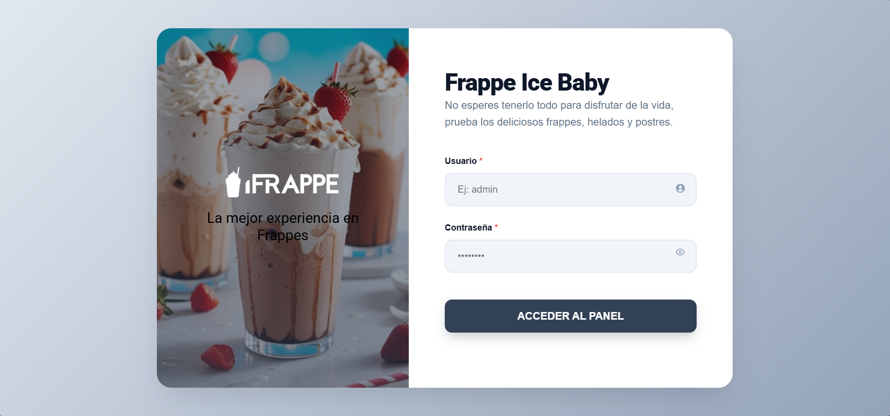
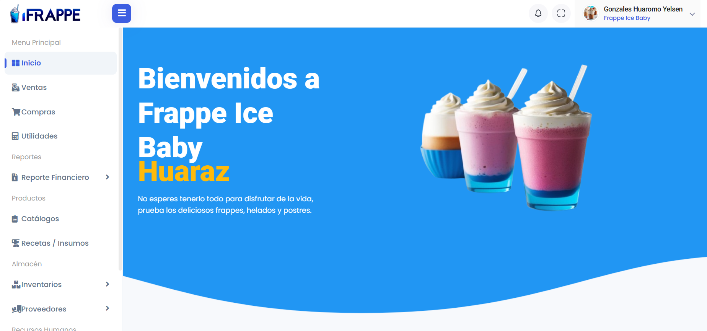

# <p align="center">🥤 Frappe Ice Baby - Sistema de Gestión Profesional</p>

<p align="center">
  
  
  
  
  
</p>

<p align="center">
  <strong>Una solución integral diseñada para modernizar y optimizar la gestión de negocios de repostería y bebidas frías.</strong>
  <br />
  Desarrollado para <i>Frappe Ice Baby - Huaraz</i>, enfocado en la eficiencia operativa y una experiencia de usuario fluida.
</p>

---

## 📸 Vista Previa del Sistema

<div align="center">
  
  <br />
  <em>Interfaz de acceso minimalista y segura</em>
  <br /><br />
  
  <br />
  <em>Dashboard principal con acceso rápido a todas las funciones</em>
</div>

---

## 🚀 Módulos y Capacidades Clave

### � Gestión Comercial
- **Motor de Ventas Inteligente:** Control total de transacciones, cálculo automático de impuestos (IGV), gestión de vueltos y emisión de comprobantes.
- **Control Financiero:** Seguimiento detallado de flujos de caja y rentabilidad del negocio.

### 📦 Operaciones e Inventario
- **Control de Stock en Tiempo Real:** Seguimiento preciso de insumos y productos terminados para evitar desabastecimiento.
- **Alertas de Seguridad:** Gestión de fechas de vencimiento para garantizar la calidad y reducir mermas.
- **Gestión de Proveedores:** Base de datos centralizada con historial de compras y contactos.

### 👥 Recursos Humanos y Seguridad
- **Control de Accesos (RBAC):** Niveles de permiso diferenciados para Administradores, Cajeros y Personal.
- **Trazabilidad Total:** Registro sistemático de todas las actividades críticas realizadas en el software.

---

## 🛠️ Stack Tecnológico

El proyecto se basa en una arquitectura **MVC (Modelo-Vista-Controlador)** que asegura un código limpio y fácil de mantener.

- **Frontend:** HTML5 Semántico, CSS3 (Moderno/Responsivo) y JavaScript nativo.
- **Backend:** PHP 8 enfocado en rendimiento y seguridad.
- **Base de Datos:** MySQL con lógica integrada (Procedimientos almacenados, Triggers y Funciones).
- **Diseño:** Iconografía de Font Awesome y tipografía premium de Google Fonts.

---

## 📂 Organización del Proyecto

```bash
📦 sistema_frappe
 ┣ 📂 config          # Configuración del servidor y conexión a BD
 ┣ 📂 controlador     # Lógica de negocio y procesamiento de datos
 ┣ 📂 databases       # Estructura SQL y scripts de migración
 ┣ 📂 imagenes        # Recursos visuales y activos del sistema
 ┣ 📂 modelo          # Gestión de datos y clases DAO
 ┣ 📂 vista           # Interfaces de usuario y componentes UI
 ┣ 📄 bdfrappe.sql    # Base de datos completa para importación
 ┗ 📄 index.php       # Punto de entrada principal
```

---

## ⚡ Instalación Rápida

1. **Entorno:** Clona el proyecto en tu carpeta `htdocs` de XAMPP.
2. **Auto-Instalación:** Abre en tu navegador `http://localhost/sistema_frappe/config/Install.php`. El sistema configurará la base de datos automáticamente.
3. **Acceso:** Entra a `http://localhost/sistema_frappe` y comienza a gestionar tu negocio.

---

<p align="center">
  Desarrollado por <strong>Yelsen Gonzales Huaromo</strong><br />
  Huaraz, Perú 🇵🇪
</p>
